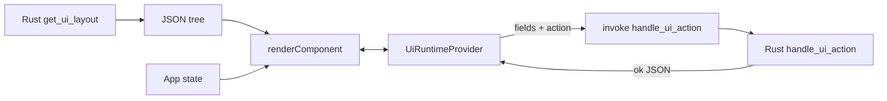

# Declarative UI system

This project ships a small **layout DSL** where Rust defines a tree of UI components, the Tauri host serializes it to JSON, and a React client renders that tree. User input and server-style feedback stay on the **front end**; Rust commands receive **actions** and **form snapshots** as simple JSON.

## Purpose

- **Single source of truth for structure**: The layout is built in Rust (see `tauri/src/ui/build.rs` and `get_ui_layout` in `tauri/src/ui/mod.rs`). You can version it, test it, and ship it without hand-writing parallel JSX for the same tree.
- **End-user state in React**: Text fields and the last command result are held in `UiRuntimeProvider` (`src/components/UiRuntimeProvider.tsx`) so the tree stays a pure view over shared state.
- **Actions over the wire**: Buttons carry a tagged `UIAction` object. Clicks call `handle_ui_action` with the current form map and **active tab id** as `payload` (see `UiRuntimeProvider`).
- **Per-tab layouts**: The top toolbar switches between `home`, `library`, and `settings`. The client calls `get_ui_layout({ view })` for the active tab; each view is a different `Vec<UIComponent>` from `layout_for_view` in `tauri/src/ui/build.rs`. The form provider is remounted on tab change so field state does not leak between views.

## Wire format (JSON)

### `UIComponent`

Internally tagged: the discriminant is the `type` field, in **camelCase** (Serde `#[serde(tag = "type", rename_all = "camelCase")]` on the Rust enum).

Examples:

```json
{
  "type": "textInput",
  "id": "email_input",
  "placeholder": "you@example.com"
}
```

```json
{
  "type": "stack",
  "id": "form_row",
  "direction": "row",
  "gap": 3,
  "children": []
}
```

`text` nodes expose optional `textVariant` (`"title"` | `"body"`, default `"body"`). `badge` uses optional `tone` (matches the React `Badge` `variant` names, default `"default"`).

### `UIAction`

Also tagged, with `actionType` and **SCREAMING_SNAKE** values for the variant name:

```json
{
  "actionType": "SUBMIT_FORM",
  "targetId": "form_profile"
}
```

```json
{ "actionType": "NAVIGATE", "path": "/docs" }
```

```json
{ "actionType": "CLOSE_WINDOW" }
```

**Note:** The TypeScript definitions in `src/types/ui.ts` are maintained by hand. They must match `tauri/src/ui/mod.rs`. A future improvement is optional codegen from the same schema (e.g. JSON Schema or a `typeshare`-style tool); until then, change both sides when you add a field or variant.

## End-to-end flow

1. `get_ui_layout` (Tauri command) takes `view: String` and returns `Result<Vec<UIComponent>, String>` (e.g. `home`, `library`, `settings`).
2. The client stores that array and maps each node with `renderComponent` (`src/components/Renderer.tsx`).
3. `TextInput` components read and write `formValues` in `UiRuntimeProvider` (keyed by `id`).
4. A `Button` with an `action` calls `runAction`, which `invoke`s `handle_ui_action` with `{ action, payload }` and `payload = { fields: formValues, view }` (active tab id).
5. Rust returns a JSON value (`Result<serde_json::Value, String>`). Success is shown in the “Last action” panel; Tauri throws on `Err` and the provider records the error string.



## Ergonomic layout building in Rust

The `ui::build` module (`tauri/src/ui/build.rs`) exposes small helpers: `vstack`, `hstack`, `text`, `text_input`, `button`, `card`, `badge`, `separator`, and `container` (legacy), plus `home_layout`, `library_layout`, and `settings_layout` wired through `layout_for_view`. Prefer these helpers so layout code reads top-to-bottom instead of large enum literals.

## How to add a new component

1. **Rust**: Add a variant to `UIComponent` in `tauri/src/ui/mod.rs` with any new Serde attributes (`rename`, `default`, etc.).
2. **Types**: Extend the `UIComponent` union in `src/types/ui.ts`.
3. **Renderer**: Add a `case` in `renderComponent` in `src/components/Renderer.tsx` and, if the node needs form or actions, a small child component that calls `useUiRuntime()`.
4. **UI kit**: Export any new primitives from `src/components/ui/index.ts` as needed.
5. **Optional**: Add a builder function in `tauri/src/ui/build.rs` and use it in `demo_layout` or your own command.

## How to add a new action

1. **Rust**: Add a variant to `UIAction` in `tauri/src/ui/mod.rs` and handle it in `handle_ui_action`.
2. **Types**: Extend `UIAction` in `src/types/ui.ts` with the same `actionType` string and fields.
3. **Front end**: No change to `runAction` is required unless you change the payload shape; the button already sends the full `action` object from the tree.

## Caveats

- **Type drift** between Rust and TypeScript is the main maintenance risk. Write a quick manual test after changing either side.
- **Security**: `invoke` is a trusted bridge to the Tauri process. Do not pass unsanitized strings into shell commands on the Rust side. Validate `payload` and `UIAction` in `handle_ui_action` before any side effect.
- **Controlled inputs** only cover fields rendered as `TextInput` with a known `id`. If you add other inputs, wire them into the same `formValues` map (or extend the context).
